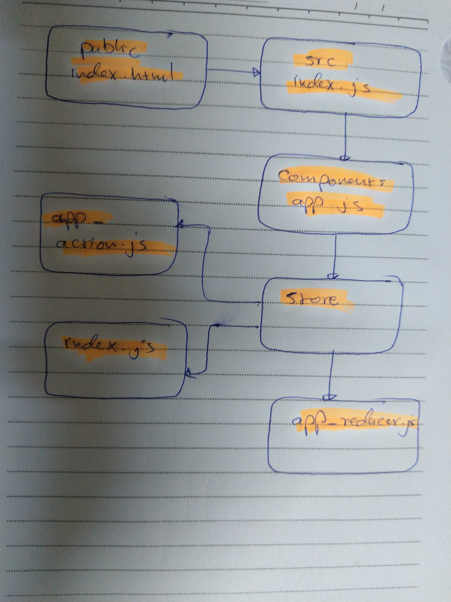

# LAB - Class 36

## Application State with Redux

### Author: Ibrahim\Naseem

### Links and Resources

- [submission PR]()

### Setup

#### How to initialize/run your application (where applicable)

`npm start`

#### UML

